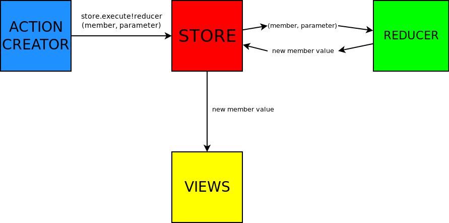

# reduxed

A library implementing the redux pattern in the D Progamming Language.


## When should you use reduxed?
The redux pattern helps, when an application has shared state that needs to be
observed and manipulated by multiple parts of the application.
Additionally, using pure reducer functions makes it easy to test state
transitions.

## Examples
```D
// Define your store as a struct
struct Bar {
	int b;
	int a;
}

// Create the store
Store!Bar store;
// set store init values
store.a = 1;
store.b = 2;

int a = 1337;

// We use this function to observe Bar.a
void fun(ref const(int) f) @safe {
	a = f;
}

// Here we subscribe to Bar.a
// Whenever Bar.a changes "fun" gets called
store.a.subscribe(&fun);

// This function is used to change the value
static int increment(int a, int b) pure {
	return a + b; 
}

// Here we call increment with the values of store.a and store.b
// the effect is equal to
// store.a = increment(store.a, store.b);
store.execute!(increment)(store.a, store.b);

assert(store.a.value == 3);
assert(a == 3);
```
